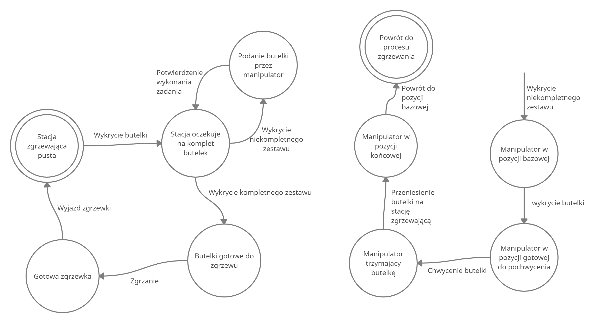

# ProjektTS2021
Projekt na Teorię sterowania

Skład: 
* Marek Kołodziejczak 
* Radosław Kulikowski 
* Radosław Goralewski 

Przedstawiony proces jest to proces kompletowania odpowiedniej ilości butelek wody oraz ich zgrzewu.

