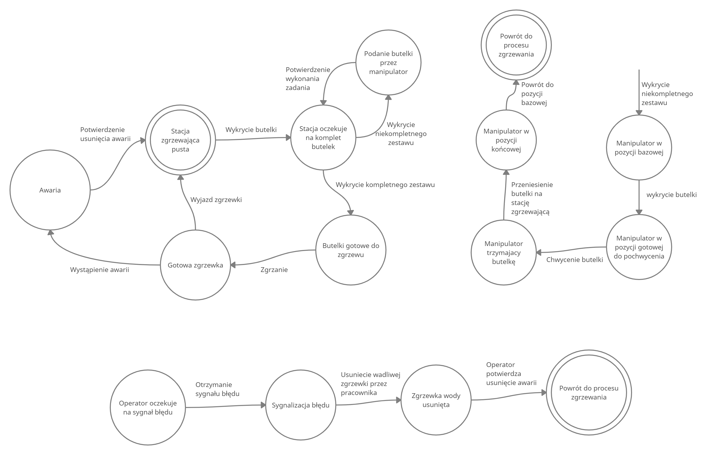

# ProjektTS2021
Projekt na Teorię sterowania

Skład: 
* Marek Kołodziejczak 
* Radosław Kulikowski 
* Radosław Goralewski 

Przedstawiony proces jest to proces kompletowania odpowiedniej ilości butelek wody oraz ich zgrzewu.




## How to install dependencies
First, make sure that you have ROS Noetic installed.
Change path to your catkin workspace, eg.:
```
cd ~/catkin_ws/src
```
Install required packages:
```
sudo apt-get install ros-noetic-moveit-commander ros-noetic-gazebo-ros-pkgs ros-noetic-gazebo-ros-control ros-noetic-moveit-ros-planning-interface ros-noetic-moveit-planners-ompl ros-noetic-joint-trajectory-controller ros-noetic-tf-conversions ros-noetic-ur-client-library ros-noetic-industrial-robot-status-interface ros-noetic-position-controllers ros-noetic-robot-state-publisher ros-noetic-tf2-tools ros-noetic-moveit-simple-controller-manager
```
```
pip3 install transforms3d
```
Clone this two repositories:
```
git clone https://github.com/UniversalRobots/Universal_Robots_ROS_Driver
```
```
git clone -b calibration_devel https://github.com/fmauch/universal_robot
```
And compile them:
```
cd ~/catkin_ws
catkin_make
```
Remember to source setup.sh file:
```
source devel/setup.sh
```

## Run
To run the Shrink Machine execute following command:
```
roslaunch shrink_machine_ros myRobot.launch
```
